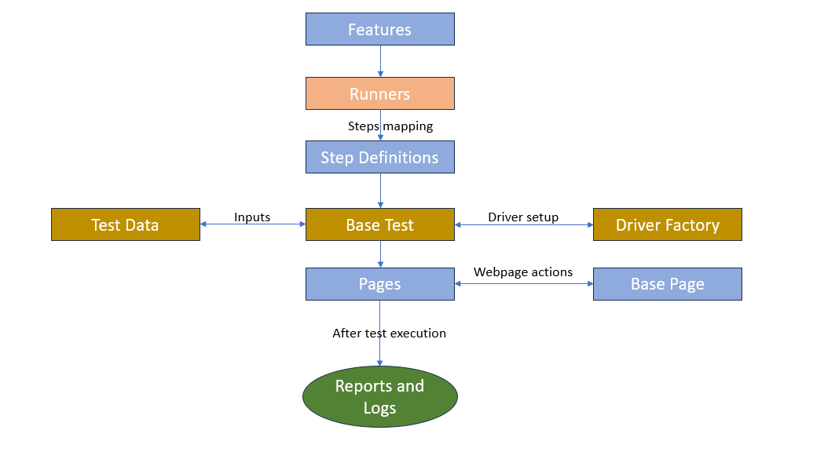

# WebPage Test Automation Framework

This is a **BDD (Behavior-Driven Development)** test automation project built using **Cucumber, Selenium, and TestNG.** The framework is designed for parallel test execution and can be easily extended and maintained for different environments and platforms.

###  Table of Contents

- [Project Overview](#project-overview)
 - [Technologies Used](#technlogies-used)
- [Folder Structure](#folder-structure)
- [Prerequisites](#prerequisites)
- [Setup Instructions](#setup-instructions)
- [How to run Tests](#how-to-run-tests)
- [Reports and Logs](#reports-and-logs)
- [Azure Pipeline Configuration](#azure-pipeline-configuration)

### Project Overview

This test automation framework supports parallel execution using **Cucumber** and **TestNG**. It enables behavior-driven development by allowing tests to be written in plain English (**Gherkin syntax**). The framework is scalable, enabling UI Automation testing, with support for taking screenshots on failure and generating detailed reports.

###    Key Features

* BDD-style test development with Cucumber.
* Parallel test execution with TestNG.
* Extensible page object model.
* Automatic screenshot capture for failed tests.
* Easily configurable via pom.xml and properties files.
* HTML reports generated after test execution.

###    Technlogies Used

* Selenium WebDriver (UI automation)
* TestNG (Test framework)
* Cucumber (BDD testing framework)
* Java 11 and above (Language)
* Maven (Build tool)
* Jackson (JSON handling)
* Apache Commons IO (File handling)
* Cucumber Reports (Reporting)

###    Folder Structure

Here’s an overview of the key folders and files in the project:

bdd-parallel-test/<p>
├── **logs/**   # Log files for test executions <p>
├── **pom.xml**                    # Maven build configuration<p>
├── **screenshots/**               # Stores screenshots for failed test cases<p>
├── **src/<p>**
│   ├── **main**/                  # Main Java code (not used for tests)<p>
│   └── **test**/<p>
│       ├── **java**/<p>
│       │   ├── **base**/          # Base classes (e.g., BaseTest)<p>
│       │   ├── **pages**/         # Page Object Model classes<p>
│       │   ├── **runners**/       # Test runners (TestNG + Cucumber)<p>
│       │   ├── **stepDefinitions**/  # Step definitions for Gherkin scenarios <p>
│       │   └── **utils**/         # Utility classes (e.g., ConfigManager)<p>
│       ├── **resources**/<p>
│       │   ├── **features**/      # Cucumber feature files written in Gherkin<p>
│       │   ├── **config.properties**  # Environment-specific properties<p>
│       │   └── **testdata**/      # Test data files (JSON, CSV, etc.)<p>
│       └── **screenshots**/       # Automatically generated screenshots<p>
├── **target**/                    # Compiled classes and test results<p>
├── **testautomation-web**/         # Web application files for local testing<p>
└── **testng.xml**                 # TestNG configuration for running tests<p>

### Key Directories and Files

* ``base/``: Contains the BaseTest.java class and other base classes for setting up WebDriver, test configuration, and teardown procedure
* ``pages/``: Follows the Page Object Model pattern for representing web pages.
* `runners/`: Test runner classes, including the setup for Cucumber and TestNG integration.
* `stepDefinitions/`: Implements the Gherkin steps defined in feature files.

#### Flow details


### Prerequisites

Before setting up and running the tests, ensure you have the following installed:

 - Java 11: Make sure Java 11 is installed and properly configured in your system.
    - To verify, run java -version in the terminal.
 - Maven: Install Apache Maven for dependency management and test execution.
    - To verify, run mvn -version in the terminal.
 - WebDriver: Download and configure WebDriver (e.g., ChromeDriver or GeckoDriver) for the browsers you intend to run tests on.
    - The WebDriver executable should be in your system PATH or set up within the framework.

### Setup Instructions

1. **Clone the Repository**

```
git clone <repository_url>
```
2. **Install dependencies**

```
mvn clean install
```

### How to Run Tests

* Run all tests
```
mvn test
```

* Run tests with specific cucumber tag
```
mvn test "-Dcucumber.filter.tags=@regression"
```

* Running tests via testNG by specifying testng.xml
```
mvn test "-DsuiteXmlFile=testng.xml"
```

### Reports and Logs

#### Test Reports

After running the tests, detailed reports are generated in the following locations:

 - HTML Cucumber Reports - Located at: `target/cucumber-reports.html`

 #### Logs
 Log files for test executions are generated and stored in the logs/ directory.

 - Log Directory: `logs/`
 - Logs include detailed information about test execution, including:
    - Driver setup
    - URL navigation
    - Test actions and assertions
    - Errors and stack traces in case of test failures

#### Screenshots

 - Screenshot Directory: `screenshots/`
 - Screenshots are automatically captured for failed test cases and stored in the screenshots/ folder.
 - Each screenshot is named based on the scenario name or test case that failed.

 ###  Azure Pipeline Configuration

 This project includes a sample YAML file(`./azure/azure-pipeline.yaml`) for configuring Azure Pipelines. If you need to set up Continuous Integration and Continuous Deployment (CI/CD), you can use the provided YAML file to automate the process in Azure DevOps.

The azure-pipelines.yml file defines how the pipeline is triggered, how the environment is set up, and how tests are executed. You can use this file to configure the automation of the BDD test framework in Azure DevOps. The pipeline automates the following:

1. **Checkout**
   - The pipeline starts by checking out the code from the repository
   - This is handled by `Checkout` task

2. **Setup JDK**
   - The pipeline installs JDK 11 using the use `Java@1` task. 

3. **Setup Maven**
   - Maven is configured in the build step using the `Maven@3` task

4. **Run the tests**
   - The pipeline runs all tests using the following command
   ```
   mvn clean test
   ```

5. **Run test with specific tags**
   - This additional step runs tets with specific tags.

   ```
   mvn clean test -Dcucumber.filter.tags="@smoke"
   ```
6. **Publish cucumber HTML reports**
   - The cucumber HTML reports are archived and uploaded to Azure pipelines as Artiffact and it can be viewed from the pipeline UI.
